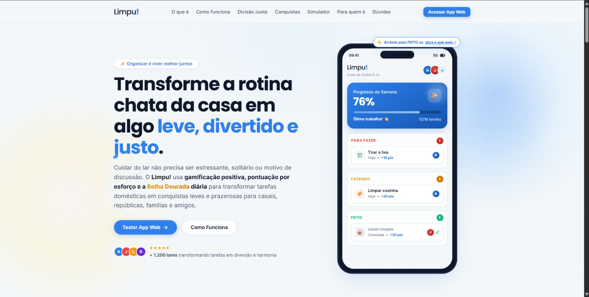
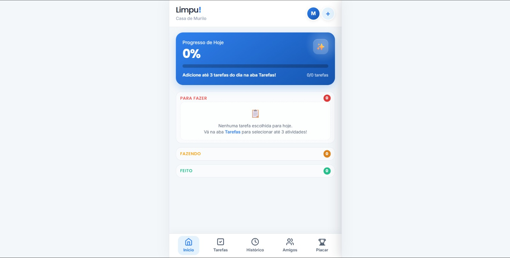
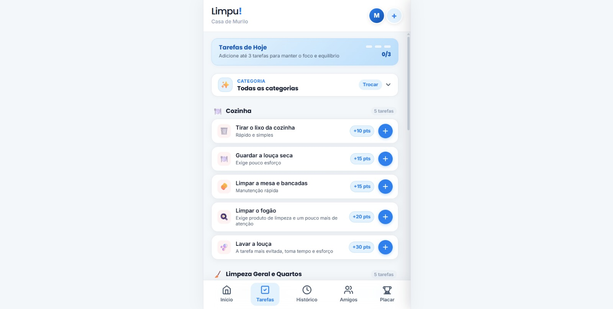
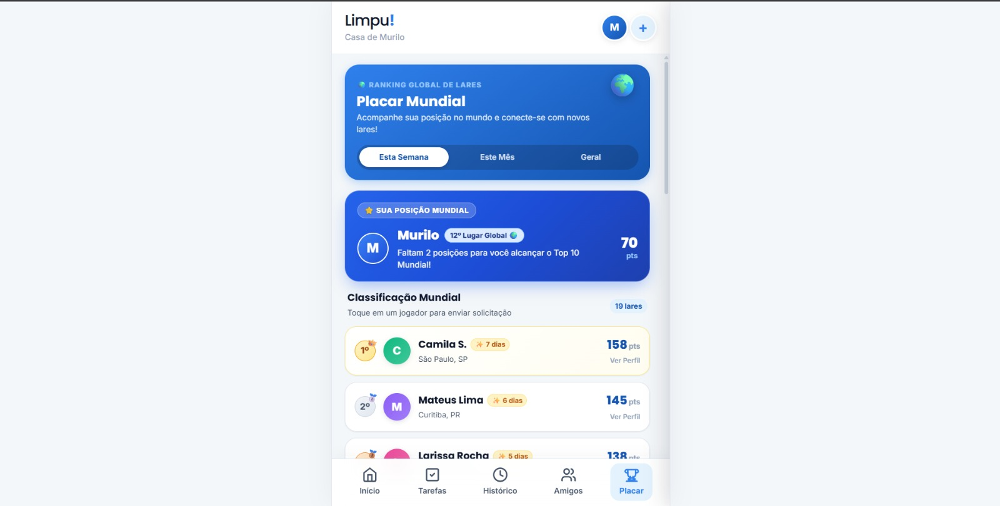

# Limpu! 🫧

> **"Organizar é viver melhor juntos."**  
> Um ecossistema inteligente e gamificado de organização e divisão justa de tarefas domésticas, desenvolvido para transformar uma rotina cansativa em uma experiência leve, divertida, colaborativa e recompensadora.

<div align="center">

[](https://github.com/MuriloGuasti/Project-LimpuApp)
[](LICENSE)
[](https://vitejs.dev/)
[](https://developer.mozilla.org/pt-BR/docs/Web/JavaScript)
[](https://developer.mozilla.org/pt-BR/docs/Web/CSS)
[](https://imaginative-ganache-73bb84.netlify.app/#)

<br />

### 🔗 [Acesse o Projeto Online](https://imaginative-ganache-73bb84.netlify.app/#)

</div>

---

## 📖 Sumário

- [💡 Sobre o Projeto](#-sobre-o-projeto)
- [✨ Principais Funcionalidades](#-principais-funcionalidades)
- [📸 Telas e Demonstração](#-telas-e-demonstração)
- [🎨 Design System & Experiência (UX/UI)](#-design-system--experiência-uxui)
- [🛠️ Tecnologias Utilizadas](#️-tecnologias-utilizadas)
- [💻 Rodando Localmente](#-rodando-localmente)
  - [Pré-requisitos](#pré-requisitos)
  - [Instalação Passo a Passo](#instalação-passo-a-passo)
- [🚀 Como Usar o Sistema](#-como-usar-o-sistema)
- [📂 Estrutura de Pastas](#-estrutura-de-pastas)
- [🧪 Testes e Validação](#-testes-e-validação)
- [📄 Licença](#-licença)
- [👤 Autor e Contato](#-autor-e-contato)

---

## 💡 Sobre o Projeto

O **Limpu!** nasceu originalmente como um projeto acadêmico de **UX/UI Design** na faculdade. O desafio central era entender e solucionar uma das maiores dores da vida cotidiana: o atrito, a sobrecarga mental e a falta de visibilidade no compartilhamento do trabalho doméstico.

Durante as etapas de pesquisa com usuários, criação de personas, arquitetura de informação e prototipagem, surgiu um apego muito especial ao conceito e ao ecossistema do **Limpu!**. O carinho pelo projeto motivou a decisão de levá-lo muito além dos requisitos da disciplina acadêmica, resultando no desenvolvimento de um produto web completo:

1. **Uma Landing Page de Alta Conversão**: com apresentação interativa, mockup dinâmico, simulador de divisão justa e explicação da metodologia de esforço;
2. **Um Aplicativo Web Interativo (Mobile-First)**: com fluxo de onboarding personalizado, quadro Kanban com cronômetro de foco, sistema de sequência da *Bolha Dourada*, comparador de esforço entre amigos e placar de pontuação global.

O foco do projeto é substituir as cobranças desgastantes e discussões por **reforço positivo, clareza visual e gamificação acolhedora**, atendendo tanto casais, famílias e repúblicas quanto quem mora sozinho.

---

## ✨ Principais Funcionalidades

- 🫧 **Gamificação Positiva (Sistema da Bolha Dourada)**:
  - Meta diária equilibrada de **20 pontos** para acender a Bolha Dourada e manter a sequência (*streak*);
  - **Escudo Protetor (Streak Freeze 🛡️)**: proteção contra imprevistos, evitando frustrações em dias atípicos.

- 🎯 **Regra das 3 Tarefas Diárias**:
  - Limite saudável de até 3 tarefas por dia para estimular o foco sustentável e combater a procrastinação sem gerar exaustão.

- 📋 **Quadro Kanban Dinâmico**:
  - Organização visual prática dividida em **Para Fazer**, **Fazendo** e **Feito**;
  - Acompanhamento do progresso diário em tempo real com barra percentual e feedback de metas.

- ⏱️ **Modo Foco Acolhedor (Cronômetro Progressivo)**:
  - Cronômetro progressivo inline (`00:00 -> 00:01...`) para focar na tarefa sem a ansiedade de uma contagem regressiva punitiva.

- 🗂️ **Catálogo por Ambientes e Esforço Balanceado**:
  - Tarefas categorizadas por cômodos: *Cozinha*, *Limpeza Geral e Quartos*, *Banheiro*, *Lavanderia* e *Cuidados Extras (Plantas & Pets)*;
  - Pontuação ponderada pelo nível de dedicação e tempo estimado (ex: +10 pts para tirar o lixo, +30 pts para lavar a louça).

- 👥 **Módulo Amigos & Comparador de Esforço ⚖️**:
  - Leaderboard semanal ordenado com animação de subida de posições;
  - **Comparador de Esforço**: diagnóstico visual de equilíbrio entre moradores (ex: 50% vs 50%);
  - **Interações Sociais**: botão para parabenizar amigos com sons de aplausos reais e chuva de emojis (`👏 ✨ 🎉`).

- 🏆 **Placar Mundial & Conquistas da Casa**:
  - Classificação global entre lares para incentivar o engajamento coletivo;
  - Desbloqueio de medalhas e conquistas de harmonia.

- 🎉 **Micro-interações Sonoras e Visuais**:
  - Celebrações com confetes animados via `canvas-confetti`;
  - Áudios procedurais suaves utilizando **Web Audio API** nativa do navegador (sem necessidade de carregar arquivos MP3 pesados).

---

## 📸 Telas e Demonstração

| Landing Page Interativa | Dashboard & Kanban |
| :---: | :---: |
|  |  |
| *Apresentação do produto, proposta de valor e mockup interativo* | *Progresso diário, quadro Kanban e cronômetro de foco* |

| Catálogo de Tarefas por Categoria | Placar & Ranking Global de Lares |
| :---: | :---: |
|  |  |
| *Seleção de tarefas diárias com limite 3/3 e pontuações claras* | *Posição no ranking mundial (Fictício) e celebração de conquistas* |

---

## 🎨 Design System & Experiência (UX/UI)

A interface foi projetada com base em rigorosos princípios de design e usabilidade:

### 📐 A Regra Cromática 60-30-10

| Proporção | Papel | Cores | Aplicação |
| :--- | :--- | :--- | :--- |
| **60% — A Base** | Neutros de Fundo | `#F4F7F9` (Canvas) · `#FFFFFF` (Cards) | Fundo suave anti-fadiga visual e cartões elevados com respiro |
| **30% — O Apoio** | Suporte Visual | `#E3F2FD` (Azul Claro) · `#F8FAFC` (Slate) | Slots de tarefas, badges inativos e containers secundários |
| **10% — A Ação** | Destaque Decisivo | `#2F80ED` (Azul de Ação) · `#1D4ED8` (Active) | Botões principais (CTAs), acento da marca `Limpu!` e links |

- 🌿 **Verde Recompensa (`#10B981`)**: Uso exclusivo para celebrar tarefas concluídas, checks e confetes.
- 👑 **Ouro Radiante (`#FBBF24`)**: Ativação da meta diária de 20 pontos e destaque de streaks.

### ✍️ Tipografia
- **Poppins (500 / 700 / 800)**: Utilizada na identidade `Limpu!`, títulos de impacto, números de streak e cronômetro;
- **Inter (400 / 500 / 600)**: Utilizada em textos de apoio, listas de tarefas, descrições e botões funcionais para leitura fluida.

---

## 🛠️ Tecnologias Utilizadas

- **Linguagens**: HTML5, CSS3, JavaScript
- **Ferramenta de Build & Dev Server**: [Vite](https://vitejs.dev/) (v5.4.2)
- **Efeitos Visuais**: [Canvas Confetti](https://www.npmjs.com/package/canvas-confetti)
- **Efeitos Sonoros**: [Web Audio API](https://developer.mozilla.org/pt-BR/docs/Web/API/Web_Audio_API) (Síntese sonora procedural de sinos, cliques e aplausos)
- **Ícones & Tipografia**: Google Fonts (*Poppins* e *Inter*)
- **Deploy & Hospedagem**: [Netlify](https://www.netlify.com/)

---

## 💻 Rodando Localmente

### Pré-requisitos
Antes de começar, certifique-se de ter instalado em sua máquina:
- [Node.js](https://nodejs.org/) (versão 18.x ou superior recomendada)
- [Git](https://git-scm.com/)

### Instalação Passo a Passo

1. **Clone o repositório:**
   ```bash
   git clone https://github.com/MuriloGuasti/Project-LimpuApp.git
   cd Project-LimpuApp
   ```

2. **Para rodar a Landing Page (Apresentação):**
   ```bash
   cd "Limpu!/LandingPage"
   npm install
   npm run dev
   ```
   > A Landing Page estará disponível em: **`http://localhost:3000`**

3. **Para rodar o Aplicativo Web (App Completo):**
   *Abra um novo terminal na pasta raiz do projeto:*
   ```bash
   cd "Limpu!/ApplicationWeb"
   npm install
   npm run dev
   ```
   > O Aplicativo Web estará disponível em: **`http://localhost:5174`**

---

## 🚀 Como Usar o Sistema

1. **Onboarding Rápido**: Ao abrir o App Web, informe seu nome, perfil da casa e objetivo principal para personalizar a experiência;
2. **Defina seu Foco Diário**: Acesse a aba **Tarefas** e selecione até 3 atividades prioritárias para o dia nos diferentes cômodos;
3. **Gerencie no Kanban**:
   - Vá para a aba **Início**;
   - Inicie uma tarefa para movê-la para *Fazendo* e acionar o cronômetro de foco;
   - Ao concluir, clique em **Terminei!** para ganhar pontos e comemorar com confetes;
4. **Mantenha a Sequência da Bolha**: Alcance 20 pontos no dia para ativar o brilho dourado da sua bolha e aumentar seu streak;
5. **Colabore com Amigos**: Acesse a aba **Amigos** para ver o ranking, enviar aplausos e usar o **Comparador de Esforço ⚖️** para manter a divisão do lar sempre equilibrada.

---

## 📂 Estrutura de Pastas

```text
Project-LimpuApp/
├── Limpu!/
│   ├── ApplicationWeb/              # Aplicativo Web Principal (Mobile-First)
│   │   ├── src/
│   │   │   ├── css/
│   │   │   │   ├── app.css          # Estilos globais e layout das abas do app
│   │   │   │   ├── components.css   # Modais, drawers, toasts e botões
│   │   │   │   ├── onboarding.css   # Fluxo de boas-vindas do usuário
│   │   │   │   ├── reset.css        # Normalização de estilos
│   │   │   │   └── variables.css    # Tokens do Design System (Cores, Fontes, Raios)
│   │   │   └── js/
│   │   │       ├── main.js          # Ponto de entrada do app
│   │   │       ├── state.js         # Gerenciamento de estado e sessão
│   │   │       ├── navigation.js    # Controle da barra de navegação inferior
│   │   │       ├── kanban.js        # Lógica do quadro Kanban e cronômetro de foco
│   │   │       ├── tasks.js         # Catálogo de tarefas e limite de 3 slots
│   │   │       ├── history.js       # Histórico, calendário e cálculo da Bolha Dourada
│   │   │       ├── friends.js       # Amigos, aplausos e comparador de esforço
│   │   │       ├── ranking.js       # Placar mundial de lares e conquistas
│   │   │       ├── onboarding.js    # Lógica dos passos de onboarding
│   │   │       ├── profileDrawer.js # Gaveta lateral de perfil e preferências
│   │   │       └── slider.js        # Componentes de ajuste de esforço
│   │   ├── index.html               # Estrutura HTML da Single Page Application
│   │   ├── package.json             # Dependências e scripts do App Web
│   │   └── vite.config.js           # Configuração do Vite (Porta 5174)
│   │
│   ├── LandingPage/                 # Landing Page Institucional & Simulador
│   │   ├── src/
│   │   │   ├── css/                 # Estilos específicos da Landing Page
│   │   │   └── js/                  # Interações, FAQ dinâmico e simulador
│   │   ├── design-system.md         # Especificação detalhada de UX e Design System
│   │   ├── index.html               # Estrutura HTML da Landing Page
│   │   ├── package.json             # Dependências e scripts da Landing Page
│   │   └── vite.config.js           # Configuração do Vite (Porta 3000)
│   │
│   └── design.md                    # Documentação geral de diretrizes visuais
│
├── docs/                            # Documentações adicionais e imagens
│   └── screenshots/                 # Imagens e capturas de tela do ecossistema
│
├── LICENSE                          # Licença MIT
└── README.md                        # Documentação principal do repositório
```

---

## 🧪 Testes e Validação

Para validar o funcionamento e a integridade de compilação dos módulos:

```bash
# Validar build da Landing Page
cd "Limpu!/LandingPage"
npm run build

# Validar build do Aplicativo Web
cd "../ApplicationWeb"
npm run build
```

---

## 📄 Licença

Este projeto está sob a licença **MIT**. Consulte o arquivo [LICENSE](LICENSE) para mais detalhes.

---

## 👤 Autor e Contato

Desenvolvido com dedicação por **Murilo Guasti Soares**.

- 📸 **Instagram**: [@muriloguasti_](https://www.instagram.com/muriloguasti_)
- ✉️ **E-mail**: [muriloguasti.contato@gmail.com](mailto:muriloguasti.contato@gmail.com)
- 🐙 **GitHub**: [@MuriloGuasti](https://github.com/MuriloGuasti)
- 🌐 **Projeto Online**: [Limpu! no Netlify](https://imaginative-ganache-73bb84.netlify.app/#)

---

<div align="center">
  <sub>Limpu! — Transformando o cuidado com o lar em harmonia e leveza. ✨</sub>
</div>